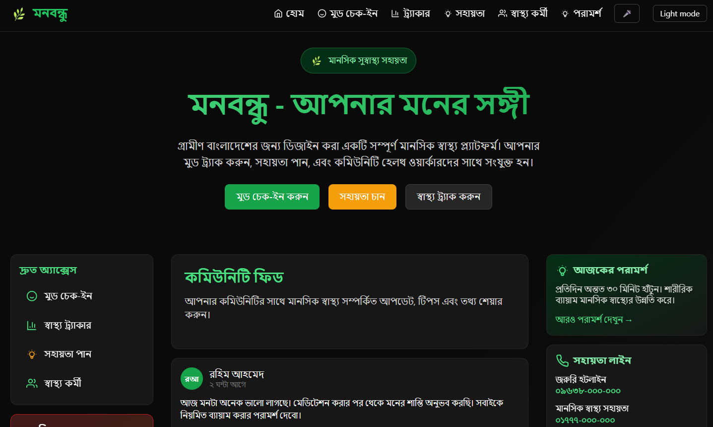

# 💙 মনবন্ধু (MonBondhu)

> **A Bengali-first mental wellness and community health support platform designed to provide accessible, supportive, and privacy-conscious resources for Bengali-speaking users.**

---

## 📌 Overview

**মনবন্ধু (MonBondhu)** is a Bengali-focused web application built around mental wellness and community health support.

The platform provides a simple and accessible experience with features such as mood tracking, supportive content, a blog, dark mode, and easily accessible crisis resources.

> **Privacy & Safety:** Mood data is stored locally on the user's device. Crisis contacts are clearly visible, and the application includes a disclaimer that it does not provide medical advice.

---

## 🌐 Live Demo

👉 **[Visit MonBondhu](https://mon-bondhu.vercel.app/)**

---

## 📸 Screenshot

### Home Page



## ✨ Features

- 🇧🇩 **Bengali-first Interface** — Designed primarily for Bengali-speaking users.
- 😊 **Mood Tracking** — Track mood information locally on the device.
- 📝 **Supportive Blog** — Browse mental wellness and community health content.
- 🌙 **Dark Mode** — Toggle between light and dark themes with preference persistence.
- 📱 **Responsive Design** — Designed for different screen sizes.
- 📩 **Contact API** — API route with Zod input validation.
- 🛡️ **Privacy & Safety** — Local mood storage, visible crisis contacts, and safety disclaimer.

---

## 🛠️ Technologies

- **Next.js** — App Router
- **TypeScript** — Strict type checking
- **Tailwind CSS** — Styling and custom theme
- **Zod** — API validation
- **Jest** — Testing
- **React Testing Library** — Component testing
- **ESLint & Prettier** — Code quality and formatting

---

## 📦 Requirements

- Node.js 18+
- npm

---

## 🚀 Local Setup

### 1. Clone the repository

```bash
git clone https://github.com/fjfahim74/MonBondhu.git
cd MonBondhu
```

### 2. Install dependencies

```bash
npm install
```

### 3. Start the development server

```bash
npm run dev
```

Open `http://localhost:3000` in your browser.

### 4. Run checks

```bash
npm run lint
npm test
npm run type-check
```

### 5. Build for production

```bash
npm run build
npm start
```

---

## 📂 Project Structure

```text
src/
├── app/            # App Router pages and API routes
├── components/     # Reusable UI components
└── lib/            # Utilities and application logic

content/
└── posts/          # Blog content
```

---

## 🧪 Testing

The project uses **Jest** and **React Testing Library** for testing.

Tests can be added under:

```text
src/**/__tests__
```

---

## 🚀 Deployment

MonBondhu is deployed with **Vercel** and can also be deployed to other Node.js hosting platforms that support Next.js.

```bash
npm run build
npm start
```

---

## 🔗 Relevant Links

- 🌐 **Live Website:** https://mon-bondhu.vercel.app/
- 💻 **GitHub Repository:** https://github.com/fjfahim74/MonBondhu

---

## 👨‍💻 Developer

**Fatiuzzaman Fahim**

- GitHub: https://github.com/fjfahim74
- LinkedIn: https://www.linkedin.com/in/fjfahim74/
